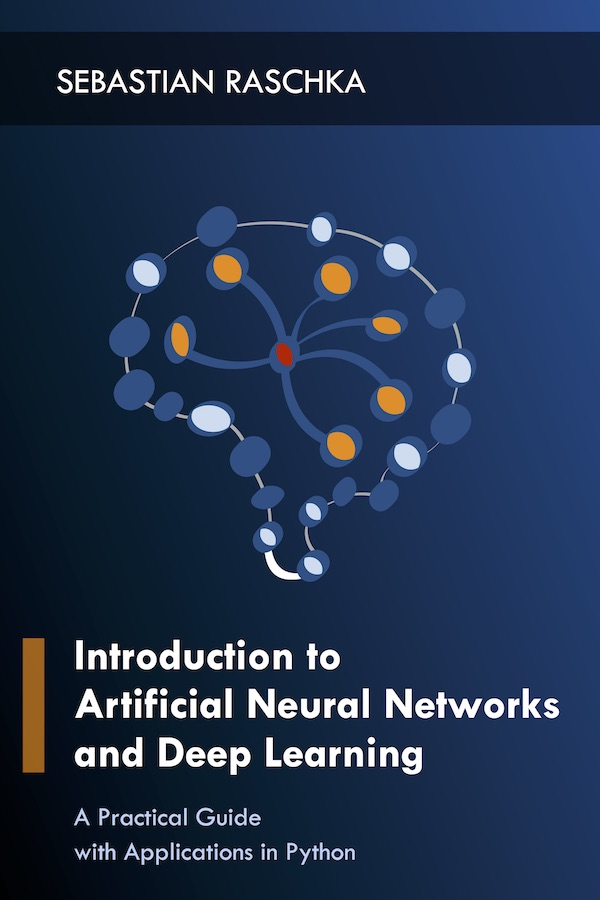

# Introduction to Artificial Neural Networks and Deep Learning: A Practical Guide with Applications in Python

Repository for the book *Introduction to Artificial Neural Networks and Deep Learning: A Practical Guide with Applications in Python*.

---

**Deep learning is not just the talk of the town among tech folks. Deep learning allows us to tackle complex problems, training artificial neural networks to recognize complex patterns for image and speech recognition. In this book, we'll continue where we left off in [*Python Machine Learning*](https://github.com/rasbt/python-machine-learning-book) and implement deep learning algorithms in [PyTorch](https://pytorch.org).**

---

- This repository will contain the instructions, code examples, and solutions for the *Hands-On* and *Exercise* portions of each chapter.

- PDF and ebook versions of the book will be available from [Leanpub](https://leanpub.com/ann-and-deeplearning).

ISBN-10: [TBA]  
ISBN-13: [TBA]  
Paperback: est. 2018  

---

## Manuscripts / Early Access Drafts

- 01 - Introduction

- 02 - The Perceptron 

- 03 - Optimizing Cost Functions with Gradient Descent

- 04 - Logistic Regression and Softmax Regression

- 05 - From Softmax Regression to Multilayer Perceptrons

- 06 - Cross Validation and Performance Metrics

- 07 - Regularization in Neural Networks

- 08 - Learning Rates and Weight Initialization

- 09 - Convolutional Neural Networks

- 10 - Recurrent Neural Networks

- 11 - Autoencoders

- 12 - General Adverserial Neural Networks

- 13 - Deep Generative Models

- 14 - Reinforcement Learning

#### Supporting Material

- Appendix A: Mathematical Notation [[PDF](https://sebastianraschka.com/pdf/books/dlb/appendix_a_math_notation.pdf)]

- Appendix B: Algebra Basics [[PDF](https://sebastianraschka.com/pdf/books/dlb/appendix_b_algebra.pdf)]

- Appendix C: Linear Algebra Essentials

- Appendix D: Calculus and Differentiation Primer [[PDF](https://sebastianraschka.com/pdf/books/dlb/appendix_d_calculus.pdf)]

- Appendix E: Probability Theory Overview

- Appendix F: Notational Conventions Reference

- Appendix G: Python Setup

- Appendix H: Introduction to NumPy [[PDF](https://sebastianraschka.com/pdf/books/dlb/appendix_numpy-intro.pdf)] [[Code Notebook](code/appendix_h_numpy-intro/appendix_numpy-intro.ipynb)]

- Appendix I: PyTorch Basics 

- Appendix I (alt.): TensorFlow Basics [[PDF](https://sebastianraschka.com/pdf/books/dlb/appendix_g_tensorflow.pdf)] [[Code Notebook](code/_old-material/appendix_tensorflow-basics/appendix_tensorflow-basics.ipynb)]

- Appendix J: Cloud Computing [[PDF](https://sebastianraschka.com/pdf/books/dlb/appendix_cloud-computing.pdf)]

#### Model Zoo

- **[Model Zoo: A collection of standalone TensorFlow and PyTorch models in Jupyter Notebooks](code/model_zoo)**

---

## About the Book

Machine learning has become a central part of our life — as consumers, customers, and hopefully as researchers and practitioners! I appreciate all the nice feedback that you sent me about [*Python Machine Learning*](https://github.com/rasbt/python-machine-learning-book), and I am so happy to hear that you found it so useful as a learning guide, helping you with your business applications and research projects. I have received many emails since its release. Also, in these very emails, you were asking me about a possible prequel or sequel.

Initially, I was inclined to write more about the "math" parts, which can be a real hurdle for almost everyone without (or even with) a math major in college. Initially, I thought that writing a book about "machine learning math" was a cool thing to do. Now, I have ~15 chapters worth of notes about pre-calculus, calculus, linear algebra, statistics, and probability theory. However, I eventually came to a conclusion that there were too many other math books out there, already! Most of them are far better and more comprehensive and accurate than my potential ~500-page introduction to the topics that I had in store. After all, I think that the real motivation for learning and understanding a subject comes from being excited about it in the first place; if you are passionate about machine learning and you stumble upon the chain rule in calculus, you wouldn't have any problems to find a trusted resource via your favorite search engine these days.

So, instead of writing that "prequel," let me write about something that's built upon the concepts that I introduced in the later chapters of [*Python Machine Learning*](https://github.com/rasbt/python-machine-learning-book) -- algorithms for deep learning. After we coded a multi-layer perceptron (a certain kind of feedforward artificial neural network) from scratch, we took a brief look at some Python libraries for implementing deep learning algorithms, and I introduced convolutional and recurrent neural networks on a conceptual level.

In this book, I want to continue where I left off and want to implement deep neural networks and algorithms for deep learning algorithms from scratch, using Python, NumPy, and SciPy throughout this educational journey. In addition to the vanilla Python science-stack, we will implement these algorithms in [TensorFlow](https://www.tensorflow.org), highly performant yet very accessible deep learning library for implementing and applying deep learning to real-world problems.

## License

### Code

All code in this repository (including the code examples in Jupyter Notebooks) is open source content, released under the [MIT software license](LICENSE). In short, the permissive MIT license allows you to do anything with the code with proper attribution and without warranty; please check the MIT [LICENSE](LICENSE) notice for further details.

### Text and Graphics

All non-code content and creative work in this repository, including text and graphics, is under exclusive copyright by the author, Sebastian Raschka. Unless noted otherwise, text content shared in this repository is intended for personal use only. You may use, modify, or share short text passages of this work with proper attribution to the author. However, if you are planning to modify and/or share substantial portions of this book for other writings, such as blog posts, magazine article, or teaching material, contact the author for permission.

Figures and graphics marked by a *Creative Commons Attribution-ShareAlike 4.0 International* are free to share under the respective license terms (as listed in the *Creative Commons Attribution-ShareAlike 4.0 International* section in the [LICENSE](LICENSE) file) and proper attribution.

## Acknowledgements

I would like to give my special thanks to the readers, who caught various typos and errors and offered suggestions for clarifying my writing.

- Appendix A: Artem Sobolev, Ryan Sun
- Appendix B: Brett Miller, Ryan Sun
- Appendix D: Marcel Blattner, Ignacio Campabadal, Ryan Sun
- Appendix F: Guillermo Moncecchi‏, Ged Ridgway
- Appendix H: Brett Miller
